# Morphing Wing Aerodynamic Prototype
Designed a scale morphing wing prototype capable of altering its aerodynamic
profile using SolidWorks, fabricated it using laser-cutting and 3D printing, 
and tested it using a wind-tunnel.

## Overview
The extent of the motion on a normal fixed-wing aircraft is purely due to 
the flaps that are on the back of each wing, which is aerodynamically 
suboptimal across different Angles of Attack. This project developed a
new type of wing that was capable of on-the-fly 'morphing' using a 
compliant mechanism, eliminating traditional hinges in the favour of elastic
deformation.

**Key result:** ~13% improvement in lift-to-drag ratio (L/D from 5.00 
to 5.68) validated through wind tunnel testing.

## Design

### Airfoil & Mechanism
- **Airfoil:** NACA 0012
- **Mechanism:** Chevron-based compliant structure: selected after 
  iterative testing of zig-zag and rectangular alternatives
- **Material:** PLA (3D printed): chosen for balance of flexibility 
  and stiffness; however, acrylic laser-cut versions were used for
  failure analysis and to identify stress concentration points
- **CAD & Simulation:** SolidWorks: stress simulation used to identify 
  and eliminate sharp-corner stress concentrations via filleting

### Design Iterations
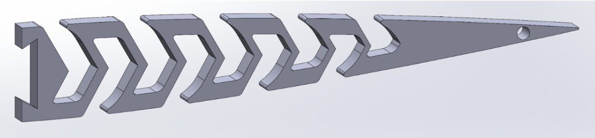
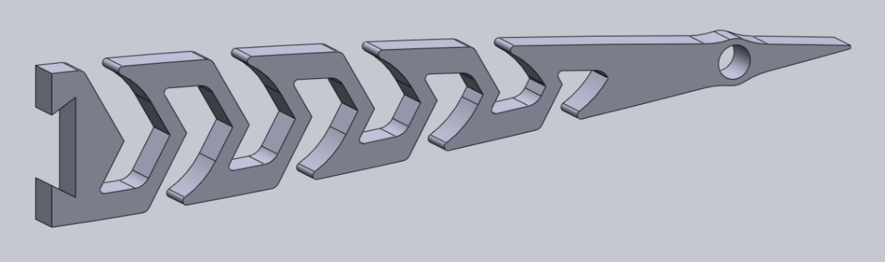
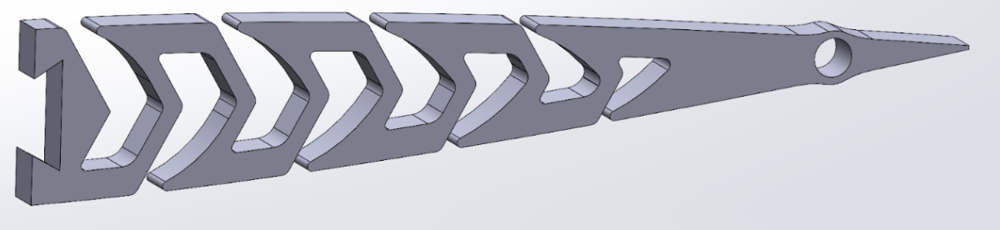

### Failure Analysis
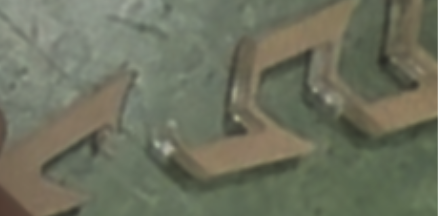
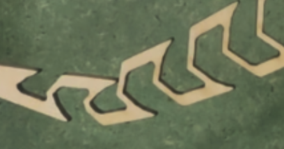
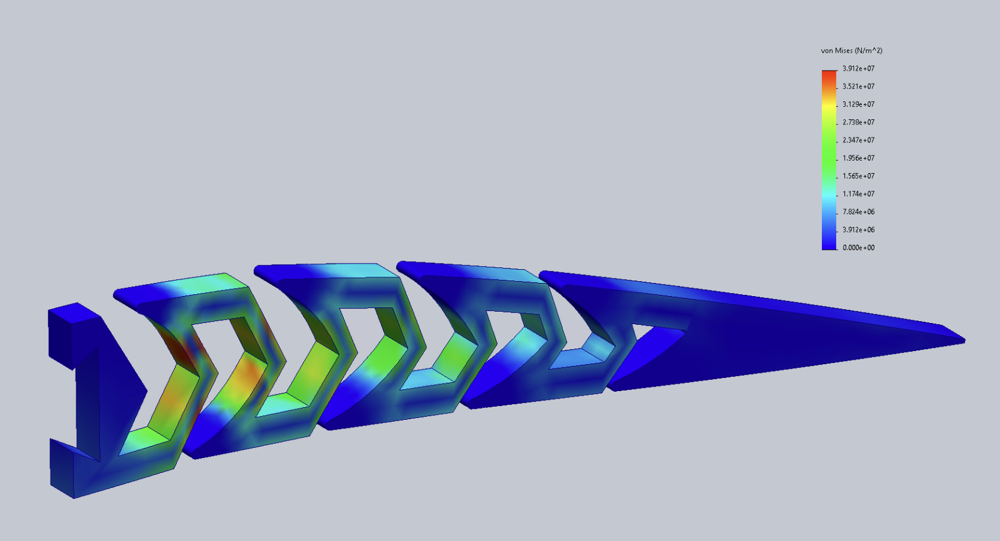

### Final Prototype
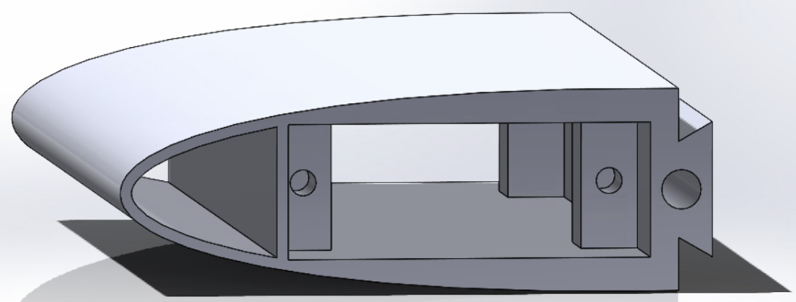

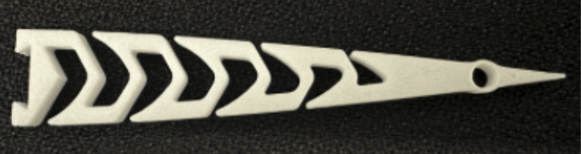

## Embedded Control System
- **Microcontroller:** Arduino Uno
- **Actuation:** 2 servo motors embedded in the leading-edge housing
- **Control:** Open-loop direct-mapping; potentiometer analog input 
  mapped to servo position via Arduino, enabling real-time wing profile 
  adaptation
- **Resultant Morphing range:** 43° angular displacement (10 cm linear)
  which exceeds the 7cm design requirement

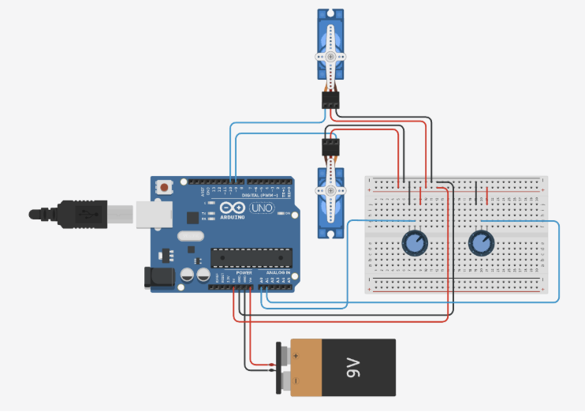
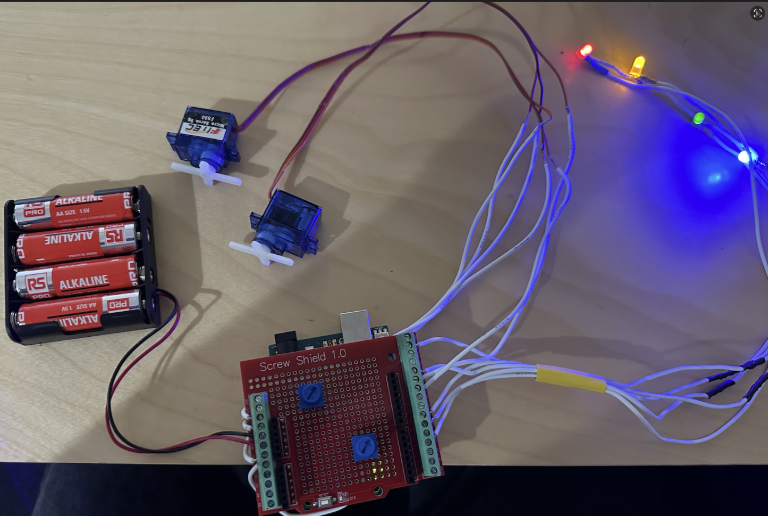

## Wind Tunnel Testing
Three tests were conducted at varying angles of attack and morphing 
configurations as follows:

| Test | Angle of Attack | Morphing | Lift (mN) | Drag (mN) | L/D  |
|------|----------------|----------|-----------|-----------|------|
| 1    | 2°             | 10° down | 300       | 60        | 5.00 |
| 2    | 5°             | 10° down | 341       | 60        | 5.68 |
| 3    | 10°            | 20° down | 542       | 130       | 4.17 |

Tests 1→2 demonstrate that with moderate morphing and increased 
angle of attack improves L/D without the typical drag penalty that comes
from increasing the angle of attack, suggesting that the morphing
successfully reduced the drag. Test 3 shows the tradeoff where greater 
morphing increases lift but also induces more drag, reducing L/D.

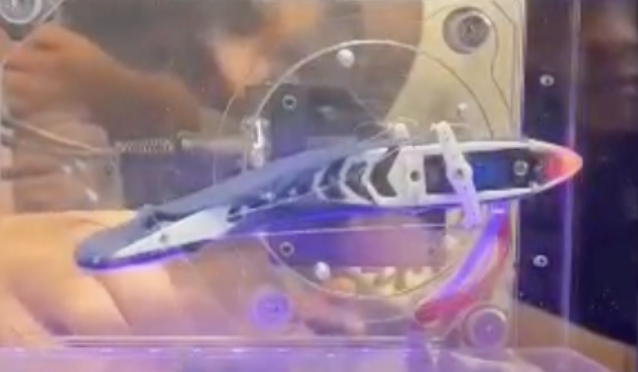
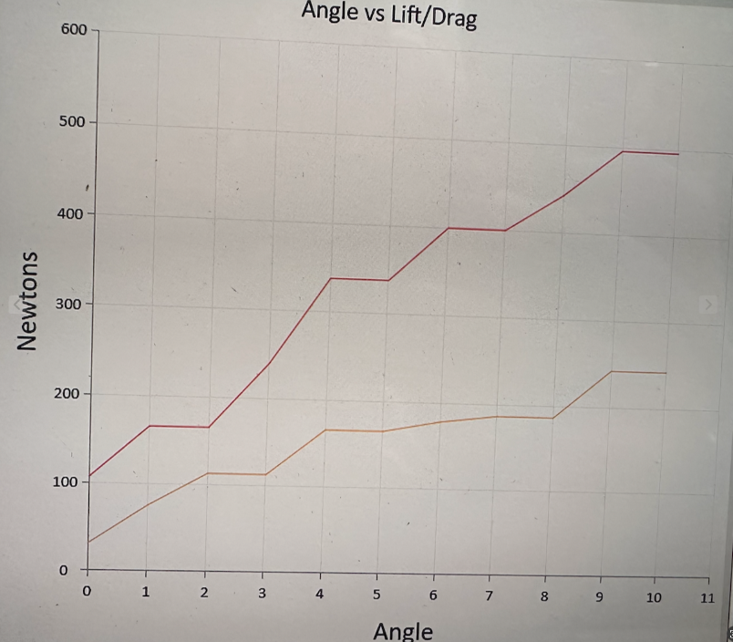

## Skills Demonstrated
- SolidWorks CAD and stress simulation
- Compliant mechanism design and iterative prototyping
- 3D printing and laser cutting
- Embedded systems (Arduino Uno, C/C++)
- Aerodynamic testing and data analysis
